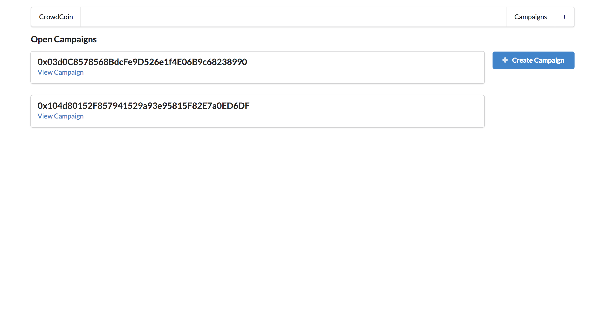
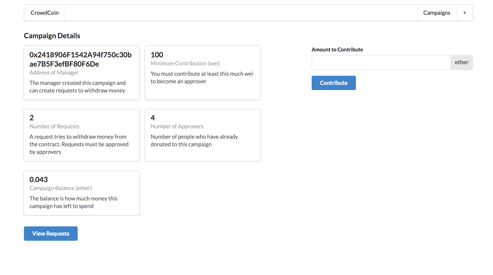
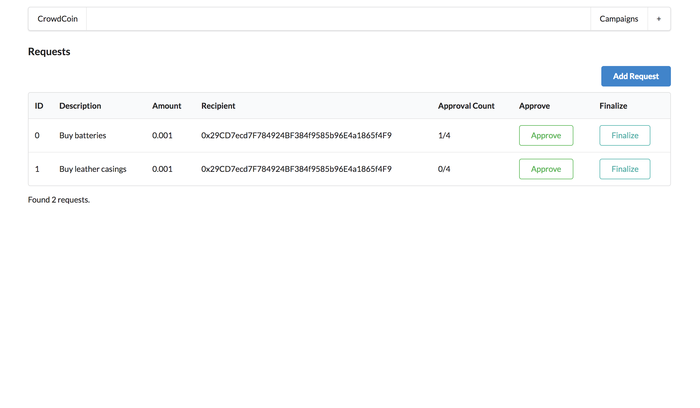
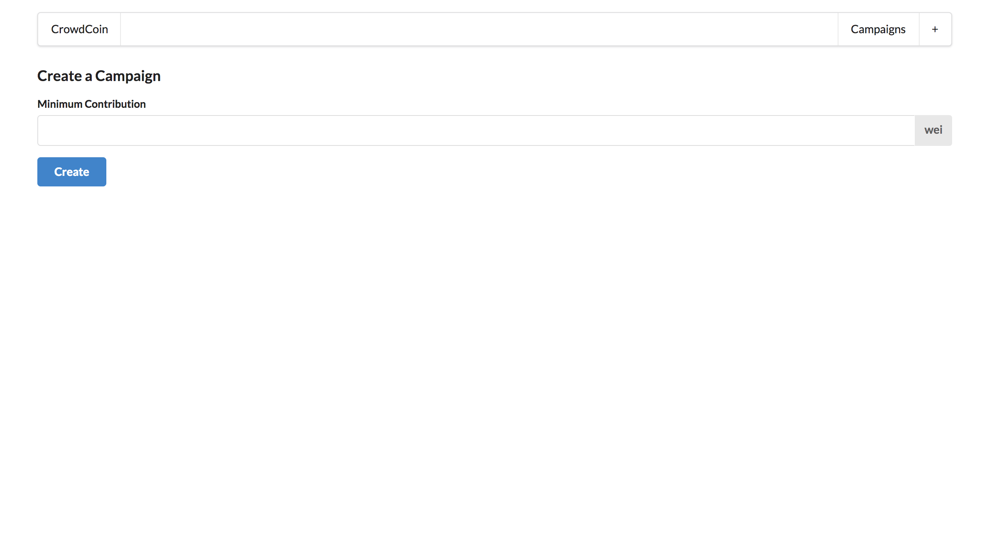

# ethereum-kickstarter

This app uses Ethereum to allow people to create a campaign in order to ask others to help fund their work. Others can contribute Ethereum to the project, and in turn get approval rights on how that money is spent. Each purchase the fund organizer would like to make is approved by the contributors. Only purchases with more than 50% approval are submitted. The app was built using React and Solidity.









## Installing

```
npm install
npm node server.js
```

## Built with

* React
* Solidity
* Node / Express
